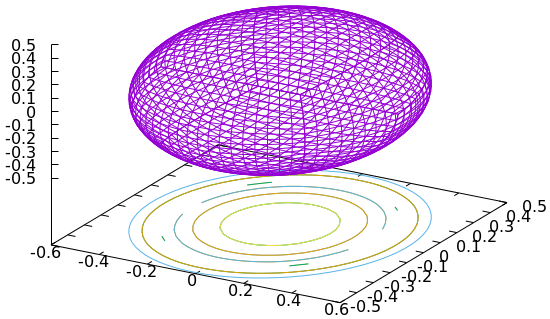
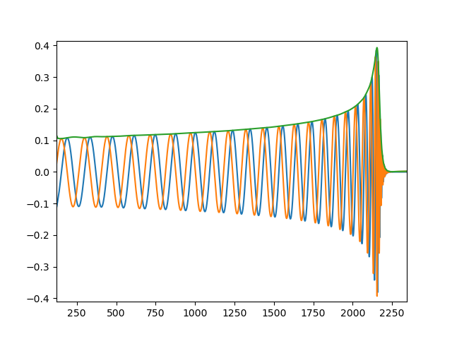
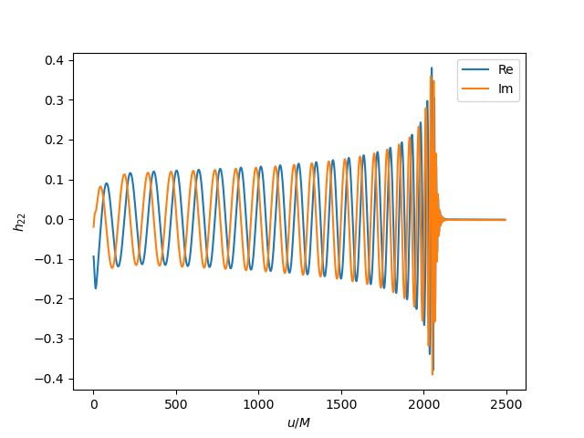

# Binary Black Hole Simulations with AthenaK

This tutorial describes how to set up, run, and analyze a binary black hole simulation with `AthenaK`. In particular, we will be performing a simulation targeted to [GW150914](https://doi.org/10.1103/PhysRevLett.116.061102), the first gravitational-wave event detected by LIGO.

This tutorial uses `AthenaK` commit [85decefa4fa5b6da63b03ca9b7a4abab5ea3f835](https://github.com/IAS-Astrophysics/athenak/commit/85decefa4fa5b6da63b03ca9b7a4abab5ea3f835) and `TwoPuncturesC` commit [166b0d01f9c26bd4a6fef0680d0407359eae3f72](https://github.com/computationalrelativity/twopuncturesc/commit/166b0d01f9c26bd4a6fef0680d0407359eae3f72).

## Compilation

This tutorial describes the compilation of `AthenaK` on a generic machine. Additional compilation options are needed to enable support for `OpenMP`, `CUDA`, `SYCL`, etc. These are described in the `AthenaK` [wiki](https://github.com/IAS-Astrophysics/athenak/wiki/Build). A collection of scripts to configure, build, and run on different machines is also available in [batchtools](https://github.com/computationalrelativity/batchtools/).

The first step is to compile `TwoPuncturesC`:
~~~bash
cd TwoPuncturesC && make
~~~

Next we can compile `AthenaK`. `AthenaK` will look for the `TwoPunctures` library in its root directory, so we need to create a symbolic link to it:

~~~bash
cd ../athenak
ln -s ../TwoPuncturesC twopuncturesc
~~~

Next, we can compile `AthenaK` using `cmake`.

~~~bash
mkdir build
cd build
cmake -D PROBLEM=z4c_two_puncture ..
make -j4
~~~

This should generate an executable in `athenak/build/src`. We have selected the [z4c_two_puncture](https://github.com/IAS-Astrophysics/athenak/blob/main/src/pgen/z4c_two_puncture.cpp) problem generator, which sets up a binary black hole simulation.

## Input File

The input file for this simulation is available in [gw150914.athinput](assets/gw150914.athinput). Here, we comment on some problem specific options.

### Grid Setup

Our grid covers a cubical region $R = [-2048, 2048]^3$. We use 4 ghost points, which correspond to 6th order finite differencing (because the advective derivatives are performed using finite differencing stencils that are shifted by one point). This also enables 7th order Kreiss-Oliger dissipation. The resolution on the coarsest grid is controlled by `nx1`, `nx2` and `nx3`, which we have set to `128`. Finally, we select `outflow` boundary conditions, which results in Sommerfeld boundary condition being applied to the appropriate `Z4c` evolved fields.

~~~text
<mesh>
nghost    = 4          # Number of ghost cells
nx1       = 128        # Number of zones in X1-direction
x1min     = -2048      # minimum value of X1
x1max     = 2048       # maximum value of X1
ix1_bc    = outflow    # inner-X1 boundary flag
ox1_bc    = outflow    # outer-X1 boundary flag
~~~

This block corresponds to the $x^1$ direction. Similar settings are specified for the coordinates $x^2$ and $x^3$ (see the full input file).

Adaptive mesh refinement (AMR) is used to increase the resolution near the punctures. This is specified in two places. First, we need to set up a grid that is pre-refined at the location of the two punctures. The block

~~~text
<refinement1>
level = 11
x1min = 4.5192
x1max = 6.5192
x2min = -1.0
x2max = 1.0
x3min = -1.0
x3max = 1.0
~~~

creates a refined region with a resolution $h = (2048/128)\cdot 2^{-11} = 0.0078125$ covering at least a region of extent $\pm 1$ around the location of the first black hole. This corresponds to ${\sim}32$ points across the coordinate radius of the relaxed puncture. Note that, because `AthenaK` uses block-based AMR and enforces a maximum of 2:1 refinement between neighboring mesh blocks, the initial grid is composed of multiple nested refined regions. An outline of the grid in the vicinity of the punctures, obtained with [plot_mesh.py](https://github.com/IAS-Astrophysics/athenak/blob/main/vis/python/plot_mesh.py), is shown in the figure below.


`AthenaK` has different options for AMR. Here, we use the position of the black holes to determine the resolution at each point in the grid.

~~~text
<z4c_amr>
method = tracker
radius_0_rad = 200.0
radius_0_reflevel = 6
~~~

In the previous block, `method` specifies that refinement is triggered for `MeshBlock`s in the vicinity of the punctures. Additionally, we require a resolution of at least $h = (2048/128) \cdot 2^{-6} = 0.25$ in the inner $200\, M$, so that we have enough resolution in the region where we extract the gravitational wave data. 

The logic for tracking the punctures is specified separately, within the `z4c` block

~~~text
<z4c>
...

## Puncture tracker
co_0_type       = BH
co_0_x          = 5.5192
co_0_radius     = 1.0
~~~

This specifies the initial position and nominal radius of the first black hole (the other black hole is treated in the same way). All `MeshBlock`s that intersect a sphere of radius `co_0_radius` within the first black hole are flagged for refinement, while `MeshBlock`s outside this region are flagged for derefinement (subject on the additional constraint that the inner $200\ M$ of the domain must be at refinement level 6 or better).

### Initial Data

Parameters for the initial data corresponds to the RIT configuration presented in [Lovelace, et al. (2016)](https://doi.org/10.1088/0264-9381/33/24/244002), see their table II. The relevant parameters are

~~~text
<problem>
par_b = 6.125                      # 1/2 separation
par_m_plus = 0.51363               # mass of the m+ puncture
par_m_minus = 0.40207              # mass of the m- puncture
target_M_plus = 0.54945            # target ADM mass for m+
target_M_minus = 0.45055           # target ADM mass for m-
par_P_plus1 = -0.00049             # momentum of the m+ puncture
par_P_plus2 = 0.083116
par_P_plus3 = 0.0
par_P_minus1 = 0.00049             # momentum of the m- puncture
par_P_minus2 = -0.083116
par_P_minus3 = 0.0
par_S_plus1 = 0.0                  # spin of the m+ puncture
par_S_plus2 = 0.0
par_S_plus3 = 0.09963
par_S_minus1 = 0.0                 # spin of the m- puncture
par_S_minus2 = 0.0
par_S_minus3 = -0.08932
center_offset1 = -0.6058000000000003       # offset b=0 to position (x,y,z)
center_offset2 = 0.0
center_offset3 = 0.0
give_bare_mass = true              # User provides bare masses not target M_ADM
~~~

Note that we specify the initial data by providing the puncture bare masses (`par_m_plus` and `par_m_minus`), and not their gravitational mass. In particular, this means that the values `target_M_plus` and `target_M_minus` are ignored. However, `TwoPuncturesC` can optionally construct initial data specified by the actual masses of the black holes. This is achieved by setting `give_bare_mass = false`. In this case, the code uses the `target_M_plus` and `target_M_minus` to determine the puncture masses `par_m_plus` and `par_m_minus`.

Note that `TwoPunctures` takes as input `par_b` and `center_offset` instead of the location of the two punctures $x_0$ and $x_1$. The formers are computed as

```math
\texttt{par\_b} = \frac{|x_0 - x_1|}{2}, \qquad \texttt{center\_offset1} = x_0 - \texttt{par\_b}.
```

It is also useful to estimate the initial orbital frequency of the binary:

```math
  f_0 = \frac{P_t}{2 \pi\, x_0\, m_0} \simeq 0.00467.
```

## Running the Code

### Code Performance

We run our calculation on 32 nodes of ALCF's Aurora. With these resources `AthenaK` performs $1.16 \times 10^9$ zone cycle updates per second, corresponding to a speed of about $450\ M/\mathrm{day}$.

### Logistics

To ensure reproducibility and avoid accidental data corruption, we create a separate folder for each restart of the simulation, e.g.,

~~~bash
$ ls gw150914

BATCH        output-0002  output-0005  output-0008  output-0011  output-0014
output-0000  output-0003  output-0006  output-0009  output-0012  output-0015
output-0001  output-0004  output-0007  output-0010  output-0013  output-0016
...
~~~

The folder `BATCH` contains a copy of the executable, submission script, and input file, curated by `batchtools`. Each `output-XXXX` corresponds to a roughly 5 hours segment in our case:

~~~bash
$ ls gw150914/output-0002

adm           bbh.co_1.txt      cce          horizon_1  N128.out     PREVIOUS
batch.sub     bbh.z4c.user.hst  ENVIRONMENT  JOBID      parent       rst
bbh.co_0.txt  bin               horizon_0    N128.err   parfile.par  waveforms
~~~

We use the script [tarsegment.sh](scripts/waveforms//tarsegment.sh) to create separate tar archives of the restart files, 2D/3D binary outputs, etc., which typically have different lifetimes.

To analyze the data, we use the utility [collate.py](scripts/workflow//collate.py) to merge time series from different segments. For example,

~~~bash
$ collate.py -t 2 -i -o bbh.co_0.txt output-????/bbh.co_0.txt
~~~

creates a full history of the trajectory of the first puncture.

### Diagnostics

We monitor the `Z4c` constraints (`bbh.z4c.user.hst`), the puncture's trajectories (`bbh.co_0.txt` and `bbh.co_1.txt`), and the multipoles of $\Psi_4$ at different extraction radii (`waveforms` folder). For example, the trajectories can be plotted from the terminal with the command 

~~~bash
gnuplot <<EOF
set term sixel
set size square
set xlabel "x/M"
set ylabel "y/M"
plot "<cat output-????/bbh.co_0.txt" u 3:4 w l notitle, \
     "<cat output-????/bbh.co_1.txt" u 3:4 w l notitle
EOF
~~~

The trajectories of the punctures at some intermediate stage during the run are shown below:


## Apparent Horizons

`AthenaK` does not yet include an apparent horizon finder. Instead, the code is set up to dump data in the vicinity of the puncture, which can later be processed using the [Einstein Toolkit](https://einsteintoolkit.org/). The "horizon" dump resolution and output frequency is specified in the input file:

~~~text
## Horizon Finder
dump_horizon_0  = true
co_0_dump_radius = 2
horizon_0_Nx     = 100
dump_horizon_1  = true
co_1_dump_radius = 2
horizon_1_Nx     = 100
horizon_dt = 5
~~~

We have collected a minimal copy of the `Einstein Toolkit` in [this repository](https://github.com/HengruiZhu99/ahfind). This can be compiled using the command

```bash
$ cd ahfind
$ ./make_config-runmefirst-getlapackblas
$ make -j4
```

To compute the horizon properties we can then run the [horizon.sh](scripts/horizon/horizon.sh) script

```bash
$ scripts/horizon/horizon.sh <path-to-simulation>
```

Note that `horizon.sh` looks for `ahfinder` in the root folder of this repository. 

We have also included an example parameter file for `ahfinder` [ET_analyze_BHaH_data_horizon.par](scripts/horizon/ET_analyze_BHaH_data_horizon.par) that can be used to overwrite the one generated by `AthenaK`. If you decide to use this parameter file, you should edit this portion

```text
Driver::global_nsize = 100
grid::xmin = -2.000000e+00
grid::xmax = 2.000000e+00
grid::ymin = -2.000000e+00
grid::ymax = 2.000000e+00
grid::zmin = -2.000000e+00
grid::zmax = 2.000000e+00
```

to match the horizon finder options in the `AthenaK` input file. Otherwise, you can comment out this line in `horizon.sh`:

```bash
cp ${ANALYSIS_HOME}/scripts/horizon/ET_analyze_BHaH_data_horizon.par . &&
```

The output files `horizon_BH_0_ahf_ihf_diags.txt` and `horizon_BH_1_ahf_ihf_diags.txt` will contain the properties of the horizons as a function of time.

Additional diagnostics are availlable within each subfolder of `horizon_0` and `horizon_1`. For example, the file `latest_ah_surface.gp` stores the coordinate shape of the apparent horizon. This can be plotted, e.g., with

```bash
gnuplot <<EOF
set term sixel
set contour
set key off
splot "latest_ah_surface.gp" u 4:5:6 w l notitle
EOF
```

An example is shown below.



## Gravitational-Wave Data

### Fixed Radius Extraction

`AthenaK` extracts the spin-weighted multipolar decomposition of the Weyl scalar $\Psi_4$ on coordinate spheres of different radius. The gravitational-wave strain in the $+$ and $\times$ polarization can be obtained by integrating the equation
$$
\ddot{h}_+ - i\, \ddot{h}_\times = \Psi_4.
$$
To avoid contaminating the strain data with red noise, this is typically done in the Fourier domain, after the application of a high-pass filter (the so-called fixed-frequency integration method). This requires us to choose a cutoff frequency $f_{\rm cut}$. To avoid removing physical parts of the waveform, $f_{\rm cut}$ should be smaller than $f_0/2$. The curoff frequency for different $m$ modes is computed as $f_{\rm cut}^m =f_{\rm cut}\, |m|/2$.

**WARNING.** `AthenaK`'s waveform data is not guaranteed to be sampled uniformly in time. For this reason, it is necessary to resample $\Psi_4$ before computing the Fourier transform.

To compute waveforms, use the [scripts/waveforms/waveforms.sh](scripts/waveforms/waveforms.sh):
```bash
$ scripts/waveforms/waveforms.sh <path-to-simulation>
```
This script will take care of merging the data from all the segments, resampling it in time, and outputting both $\Psi_4$ and $h$ in a new subfolder `waveforms`. For instance:
```bash
$ ls waveforms

rpsi4_imag_0010.txt  rpsi4_imag_0150.txt  rpsi4_real_0050.txt  rpsi4_real_0200.txt
rpsi4_imag_0050.txt  rpsi4_imag_0200.txt  rpsi4_real_0100.txt  strain.h5
rpsi4_imag_0100.txt  rpsi4_real_0010.txt  rpsi4_real_0150.txt
```

The following python script shows how to plot the $(\ell,m)= (2,2)$ mode of the signal

```python
import h5py
import matplotlib.pyplot as plt
import numpy as np

dfile = h5py.File("strain.h5", "r")
t = np.array(dfile['r0100']['t'])
h22 = np.array(dfile['r0100']['h[2,2]'])

plt.plot(t, np.real(h22))
plt.plot(t, np.imag(h22))
plt.plot(t, np.abs(h22))

plt.show()
```

The resulting waveform is shown below.



### Cauchy Characteristics Extraction

#### Background

To compute the CCE strains, we require the spherical harmonics coefficients 
of the ADM variables on a nested set of spherical shells at various time steps.

For the spherical harmonics decomposition, we use an angular grid with Gauss-Legendre 
points in $cos(\theta)$ and uniformly spaced points in $\phi$.

The radii of the nested shells are chosen to lie at Chebyshev collocation
points (the roots of Chebyshev polynomials of the second kind) 
distributed between the innermost and outermost shells.
The ADM variables are interpolated onto these radial collocation points.
This allows the Python script `athk_to_spectre.py` to compute radial derivatives 
of the variables at any specified extraction radius.

Finally, the spherical harmonic coefficients and the radially interpolated 
values of ADM variables are written to a binary format file (`.bin`) 
to be used in world tube boundary data of the `Spectre CCE` code.


#### Requirements

1. [`Spectre CCE` executable](https://spectre-code.org/tutorial_cce.html)  
2. [`scri` (BMS transformation package)](https://scri.readthedocs.io/en/latest/README.html)  
3. Python packages:  
   - `numpy`  
   - `h5py`  
   - `scipy`  
   - `matplotlib`  


#### Compute CCE Strains using `Spectre CCE`

##### Step 1: Convert Boundary Data to Spectre Format

First, convert the binary boundary condition data into a format readable by 
`Spectre CCE` using the script `athk_to_spectre.py`.

Before launching the script, identify the `dump_extraction_radius`, 
which can be found in the `AthenaK` parameter file. 
This radius is typically set midway between the inner and outer radii 
of the shell where the ADM data are interpolated.

```bash
./athk_to_spectre.py -ftype bin \
                     -fpath [data_path] \
                     -radius [dump_extraction_radius] \
                     -d_out [output_directory]
```

After conversion, the output directory will contain an `.h5` file, 
named like `CceRXXXX.h5`, where `XXXX` denotes the extraction radius.

##### Step 2: Prepare the WorldTube data

**TODO:** this step is only necessary with newer versions of `SpECTRE` and is currently not working. Jump directly to step 3, if you are using version `2024.09.29`.

The next step is to convert the ADM data to worldtube Bondi-Sachs data. This can be done using the `PreprocessCceWorldtube` executable from `SpECTRE`:

```bash
apptainer exec spectre.sif \
    /work/spectre/build/bin/PreprocessCceWorldtube \
    --input-file PreprocessCceWorldtube.yaml 
```

An example input file for `PreprocessCceWorldtube` is listed below.

```yaml
InputH5File: CceR0050.00.h5
OutputH5File: ReducedWorldtubeR0050.h5
ExtractionRadius: 50
FixSpecNormalization: False
DescendingM: False
BufferDepth: Auto
LMaxFactor: 3
InputDataFormat: MetricModal
```

For more on the Bondi format, refer to the 
[Spectre CCE tutorial](https://spectre-code.org/tutorial_cce.html#autotoc_md58).

##### Step 3: Run `Spectre CCE`

The `ReducedWorldtubeR0050.h5` data can finally be used to compute the waveform.

Set the`BoundaryDataFilename` variable in [CharacteristicExtract.yaml](scripts/cce/CharacteristicExtract.yaml) to point to `ReducedWolrdtubeR0050.h5` and then run `Spectre CCE` with:

```bash
apptainer exec spectre.sif \
    /work/spectre/build/bin/CharacteristicExtract \
    --input-file CharacteristicExtract.yaml
```

#### BMS Transformation

The output from `Spectre CCE` is not in the superrest frame. To transform the waveform, apply a _BMS transformation_ using `scri`. For more detail see:

- [Frame fixing](https://spectre-code.org/tutorial_cce.html#autotoc_md65)
- [Scri tutorial](https://scri.readthedocs.io/en/latest/tutorial_abd.html#loading-cce-data-and-adjusting-the-bms-frame)

Example:

```python
import scri
import matplotlib.pyplot as plt
import numpy as np

# Load and transform waveform to the superrest frame
w = scri.WaveformModes()
abd = scri.create_abd_from_h5(
    file_name="/path/to/CharacteristicExtractReduction.h5",
    file_format="spectrecce_v1",
    ch_mass=1.0,
    t_0_superrest=t0,     # time after junk radiation
    padding_time=w0,      # ~2 orbital periods
    t_interpolate=times   # resample data to reduce memory load
)
h = abd.h

# Plot h_22 mode
plt.plot(h.t, np.real(h.data[:, h.index(2, 2)]))
plt.plot(h.t, np.imag(h.data[:, h.index(2, 2)]))

# Access real and imaginary parts
re = h.data[:, h.index(2, 2)].real
im = h.data[:, h.index(2, 2)].imag
```

This is how the CCE waveform looks like



We provide a script to convert the CCE data to SpEC waveform data format: [super_rest.py](scripts/cce/super_rest.py).

#### Debugging Tools

Use the [debug_athk_to_spectre.py](scripts/cce/debug_athk_to_spectre.py) script to analyze and debug the output of [athk_to_spectre.py](scripts/cce/athk_to_spectre.py). You can inspect specific spherical harmonic modes over time, or examine convergence and derivatives.

Example: Plot the real part of the $(2,2)$ mode of $g_{xx}(t)$

```bash
$ scripts/cce/debug_athk_to_spectre.py -debug plot_simple \
  -dout [output_directory] \
  -fpath [/path/to/CceRXXXX.h5] \
  -field_name "gxx" -field_mode "Re(2,2)"
```
